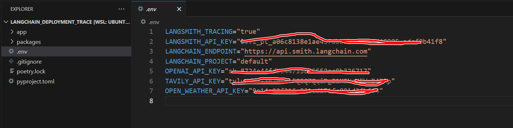
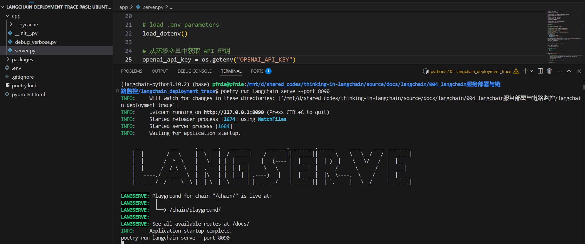
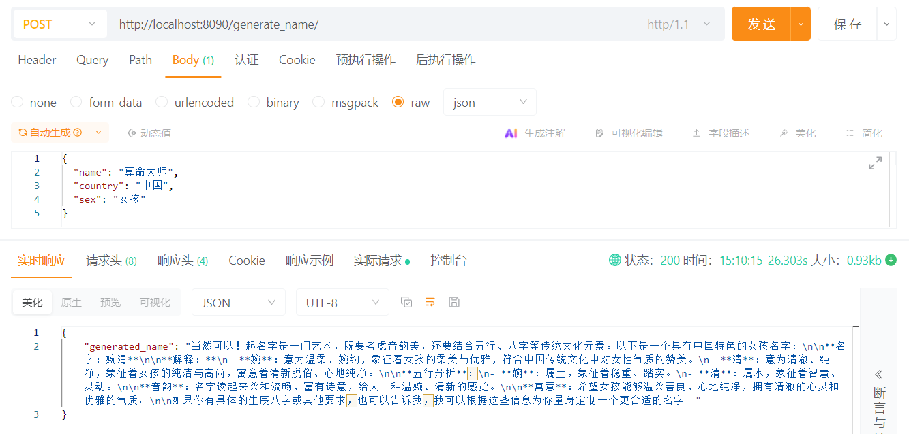
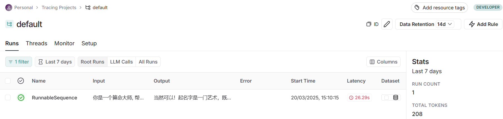

# langchain服务部署与链路监控

## 1. Helloworld工程

### 1.1 创建项目

创建一个LangChain项目:

```bash
langchain app new langchain_deployment_trace
```

```
pip index versions poetry
pip install poetry==2.1.1
```

添加依赖：

```bash
poetry add langchain==0.3.20
poetry add langchain-community==0.3.19
poetry add langchain-openai==0.3.8
poetry add langsmith==0.3.15
poetry add python-dotenv==1.0.1
```

**创建.env文件**

接下来创建.env文件，并写入DeepSeek的API-Key以及服务地址和其他配置。

```
touch .env
```

```
LANGSMITH_TRACING=true
LANGSMITH_API_KEY="<your-langsmith-api-key>"
LANGCHAIN_ENDPOINT="https://api.smith.langchain.com"
OPENAI_API_KEY="<your-openai-api-key>"
```



### 1.2 LangServe服务部署

```bash
poetry run langchain serve --port 8090 
```

启动之后我们将会看到：


然后我们使用Postman进行测试：



### 1.3 LangSmith Tracing 跟踪

最后我们在langsmith上查看链路监控:



### 1.4 Verbose & Debug 详细日志打印

 在.env文件中加入如下内容:

```bash
TAVILY_API_KEY="<your-tavily-api-key>"
```

参考debug_verbose的代码。

**参考：**

- LangSmith官网： [https://smith.langchain.com]( https://smith.langchain.com)
- tavily官网: [https://tavily.com](https://tavily.com)

