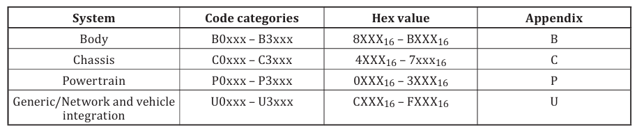
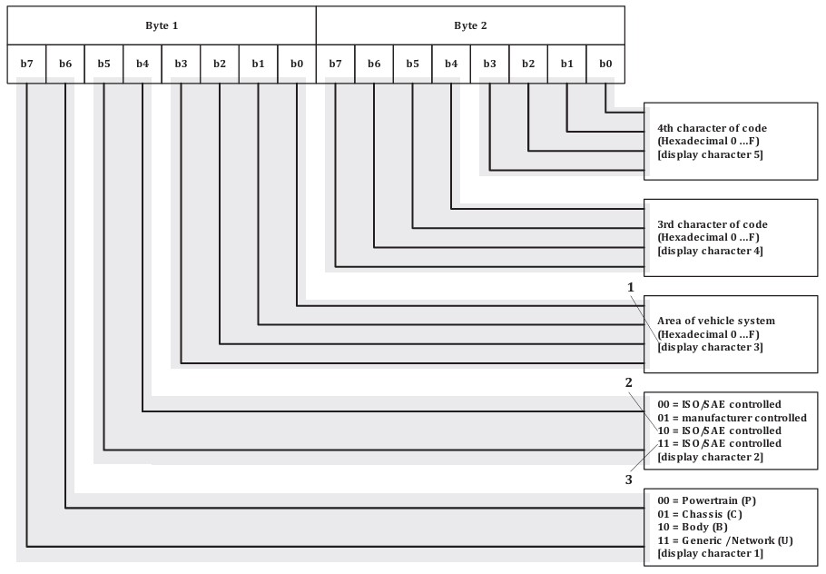
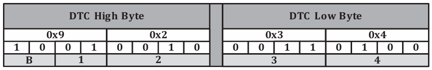
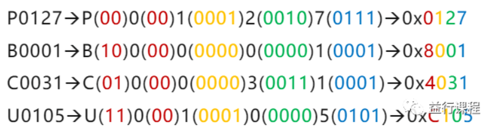

## General specification

 6.1 General code information 

It specifies systems, code categories, hexadecimal values, and particular sections of  electrical/electronic systems diagnostic.

推荐的故障诊断码由一个**三位十六进制代码**和**一个字母数字**组成指示符。

字母数字指示符为“B0”、“B1”、“B2”、“B3”、“C0”、“C1”、“C2”、“C3”、“P0”、“P1”，“P2”、“P3”、“U0”、“U1”、“U2”、“U3”，对应四套车身、四套底盘、四套动力总成和四组网络和车辆集成故障代码。

## Format structure

### Description

DTC(Diagnostic Trouble Code)诊断故障码的组成结构：该代码由一个字母数字标识符（B0-B3表示车身系统，C0-C3表示底盘系统，P0-P3表示动力总成系统，U0-U3表示网络通信系统）和后续三个字符组成。字母标识符的选用应依据该功能最适用的系统领域进行确定。在多数情况下，由于诊断信息是从特定控制器请求获取，其字母标识符通常是隐含的。但需注意，同一控制器支持的所有故障码并不强制要求使用相同的字母数字标识符。根据ISO15031-6的DTC定义，如下所示：

###  Structure of diagnostic trouble codes

 DTCs decoding according to this part of ISO 15031 may be either 2 bytes in length (e.g. SAE J1979) or 3  bytes in length (e.g. ISO 14229-1).

根据ISO 15031的这一部分进行的DTC解码长度可以是2个字节（例如SAE J1979）或3个字节（如ISO 14229-1）。

When 2-byte DTCs are used in accordance with this specification, they are always decoded according to  a single list as contained within SAE J2012-DA. 

When 3-byte DTCs are used in accordance with this specification, the two most significant bytes are  decoded based upon the DTC Format Identifier (0016 or 0416) specified by the implemented diagnostic  protocol; the least significant byte is decoded based upon SAE J2012-DA failure type byte (FTB) table.

- ISO 15031-6 与 SAE J1979

  **故障码定义关联**：ISO 15031-6 规定了与车辆排放相关的诊断故障码（DTC）的格式、内容和编码规则等。SAE J1979 也涉及故障码的定义和解析，在 OBD - II 系统中，SAE J1979 定义了车辆与诊断工具之间如何通信以获取故障码等信息，并且与 ISO 15031-6 在故障码方面有一定的对应和一致性。例如，ISO 15031-6 中的故障码格式在一定程度上是 SAE J1979 中故障码解析和应用的基础。

  **基于 OSI 模型的联系**：在开放系统互连（OSI）基本参考模型中，ISO 15031-6 属于表示层（layer 6）的规范，SAE J1979 与 ISO 15031-5 共同规定了诊断服务（layer 7），二者在基于 OSI 模型的车辆诊断通信架构中有各自明确的层次和功能定位，相互配合以实现完整的车辆诊断通信过程。

- ISO 15031-6 与 ISO 14229-1

​		**诊断数据规范的协同**：ISO 15031-6 侧重于排放相关诊断故障码的规范，而 ISO 14229-1 作为统一诊断服务（UDS）的核心标准，		定义了汽车电子控制单元（ECU）的诊断通信协议，包括各种诊断服务、服务标识符（SID）等。在实际应用中，ISO 15031-6 中		故障码所包含的信息可以通过 ISO 14229-1 定义的诊断服务来获取和传输，二者在诊断数据的规范和传输方面存在协同关系。

​		**故障码格式差异与关联**：虽然 ISO 15031-6 对应的 OBD 系统和 ISO 14229-1 对应的 UDS 系统在故障码格式上有所不同，如UDS 的 		DTC 为高中低三个字节，OBD 为高低两个字节，OBD DTC 为 UDS DTC 的高中两个字节，第三个字节为故障属性，但它们在车辆		诊断中是相互补充的，共同为车辆故障的诊断和定位提供全面的支持。

- SAE J1979 与 ISO 14229-1

  **协议衍生关系**：传统的 SAE J1979 在技术上与 ISO 14229-1 有一定的一致性。后来 SAE J1979 细化为多个部分，其中 SAE J1979 - 2 的开放系统互联模式应用层是 ISO 14229 -1 的衍生，它基于 ISO 14229 标准化的统一诊断服务（UDS）描述了 OBD 系统与扫描工具之间的通信，是对 UDS 协议针对 OBD 应用的扩展和规定。SAE J1979-3 又是 SAE J1979-2 的子集，也与 ISO 14229-1 存在一定的衍生关系。

  **功能与应用场景差异**：SAE J1979 主要是美国 OBD - II 系统的核心标准之一，为车辆与外部诊断设备之间基于 OBD - II 的通信提供规范，重点在于排放相关的诊断和数据读取3。ISO 14229 - 1 则更侧重于汽车电子控制单元内部的诊断通信，为车辆内部各控制单元之间以及与外部诊断设备之间的诊断通信提供统一标准，其应用场景更广泛，不仅包括排放相关诊断，还涵盖了车辆的各种电子控制功能的诊断。

根据 ISO 15031-6，DTC（诊断故障码）的格式和含义如下:

| 字符位置 | 含义               | 通用码相关说明                                               |
| -------- | ------------------ | ------------------------------------------------------------ |
| 第 1 个  | 故障所属系统       | 00 = P，代表动力总成（引擎和传动系统） 01 = C，代表底盘故障，如制动系统或底盘控制模块故障  10 = B，代表车身故障，如车身电子系统故障  11 = U，代表网络通信故障，表示车辆各系统之间的通信故障 |
| 第 2 个  | 表示故障类型       | 00 = 0，代表 ISO/SAE 标准定义的故障码 01 = 1，代表厂商自定义码（由车企扩展定义） 10 = 2，代表 ISO/SAE 标准定义的故障码 11 = 3，代表 ISO/SAE 标准定义的故障码 |
| 第 3 个  | 故障所属的子系统   | 占用 4 位数据长度，具体含义根据不同系统有所不同              |
| 第 4个   | 具体故障对象和类型 | 占用 1 字节数据                                              |
| 第 5 个  | 具体故障对象和类型 | 占用 1 字节数据                                              |

以下是按照上述规则以表格形式呈现的示例：

| 故障码 | 通用码（部分）                                    | 具体故障号                                      |
| ------ | ------------------------------------------------- | ----------------------------------------------- |
| P0127  | “P” 表示动力系统，“0” 为 ISO/SAE 定义的通用码     | “127” 代表进气温度过高                          |
| B0001  | “B” 表示车身系统，“0” 为 ISO/SAE 定义的通用码     | “001” 代表驾驶员正面第 1 阶段展开控制（子错误） |
| C0031  | “C” 表示底盘系统，“0” 为 ISO/SAE 定义的通用码     | “031” 代表左前轮速度传感器（子错误）            |
| U0105  | “U” 表示网络通信系统，“0” 为 ISO/SAE 定义的通用码 | “105” 代表与喷油器控制模块通讯丢失              |

### **DTC的16进制表示**

通过诊断通信获取的DTC通常是16进制数值，而非5个字符形式，需要转换一下。那么上面例子中字符形式的DTC，如果采用16进制表示，将如何计算？先看个例子：

这样不难计算得到文章开头的4个DTC的16进制表示，如下：

ISO 15031-6 和 SAE J2012 虽然都涉及 **诊断故障码（DTC, Diagnostic Trouble Code）** 的定义，但它们的定位、应用场景和标准化目标不同。以下是两者的详细对比和共存原因：

### **1. 标准背景与制定机构**

| **标准**         | **ISO 15031-6**                   | **SAE J2012**              |
| :--------------- | :-------------------------------- | :------------------------- |
| **发布机构**     | 国际标准化组织（ISO）             | 美国汽车工程师学会（SAE）  |
| **主要适用范围** | 全球（尤其欧盟EOBD、中国OBD法规） | 北美（OBD-II法规核心标准） |
| **依赖法规**     | 欧盟ECE R83、中国GB 18352等       | 美国EPA/CARB OBD-II法规    |

### **2. 核心差异**

#### **(1) DTC格式与分类**

- **ISO 15031-6**：
  - 采用 **4字节（32位）DTC**，格式为`[字母][数字][数字][数字]`（如`P1234`）。
  - 字母前缀表示故障域（`P`=动力系统，`C`=底盘，`B`=车身，`U`=网络）。
  - **兼容性强**：支持厂商自定义DTC。
- **SAE J2012**：
  - 定义 **5字节DTC**（实际常用4字节显示，如`P0123`）。
  - **严格标准化**：
    - 故障码范围固定（如`P0000-P1FFF`为SAE定义，`P2000-P3FFF`为厂商自定义）。
    - 具体故障码含义明确（如`P0101`=“空气流量传感器范围/性能故障”）。

#### **(2) 标准化程度**

- **ISO 15031-6**：
  - 提供DTC的**通用框架**，允许各地区/厂商灵活扩展。
  - 例如，中国国六OBD在ISO基础上增加了电动车专用DTC（如`P1E00`系列）。
- **SAE J2012**：
  - **高度标准化**，强制要求所有OBD-II车辆使用统一的DTC定义（如`P0420`=“催化效率低”必须一致）。
  - 减少维修歧义，确保美国/加拿大市场的扫描工具通用性。

## 参考
